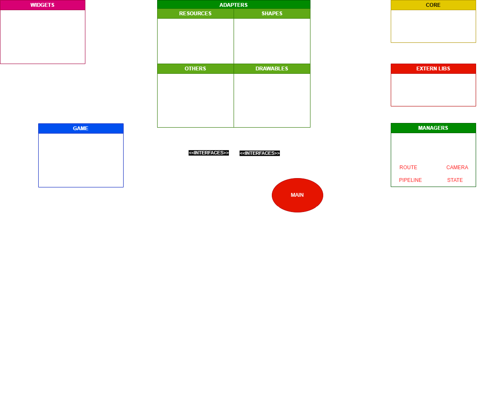

# Projeto de estudo C++ 23

> Estou migrando um projeto em C# para C++ 23 enquanto estudo.

> O projeto principal é uma mistura de elementos de interface e um jogo 2D TopDown.

## Progresso
| Core           | Adapters         | Managers       | Widgets         | Views			| Huds			 | Elements		         |
|----------------|------------------|----------------|-----------------|----------------|----------------|-----------------------|
| [x] Event      | [x] Rect         | [ ] State      | [ ] Button	   | [ ] WorldScene | [ ] LoggerHud  | [ ] Node2D            |
| [x] Enums      | [x] Vector       | [x] Sound      | [ ] ImageButton |				|                | [ ] Body2D            |
| [ ] Entities   | [x] Viewport     | [x] Event      | [ ] TextButton  |				|				 | [ ] MovementComponent |
|                | [x] Text         | [ ] Route      | [ ] TextEntry   |				|				 |				         |
|                | [x] Circle       | [x] Camera     | [ ] RitchTextBox|				|				 |				         |
|                | [x] Sprite       | [x] Window     | [ ] StackPanel  |				|				 |				         |
|                | [x] Rectangle    | [ ] Pipeline   | [ ] GridPanel   |				|				 |				         |
|                | [x] Font         | [x] Resource   |				   |				|				 |				         |
|                | [x] Sound        |                |                 |                |                |                       |
|                | [x] Music        |                |                 |                |                |                       |
|                | [x] Texture      |                |                 |                |                |                       |
|                | [x] Window	    |                |                 |                |                |                       |
|                | [x] Enum Fn      |                |                 |                |                |                       |
|                | [x] Alias/Consts |                |                 |                |                |                       |
|                |				    |                |                 |                |                |                       |
|                |				    |                |                 |                |                |                       |

## Estrutura do projeto

